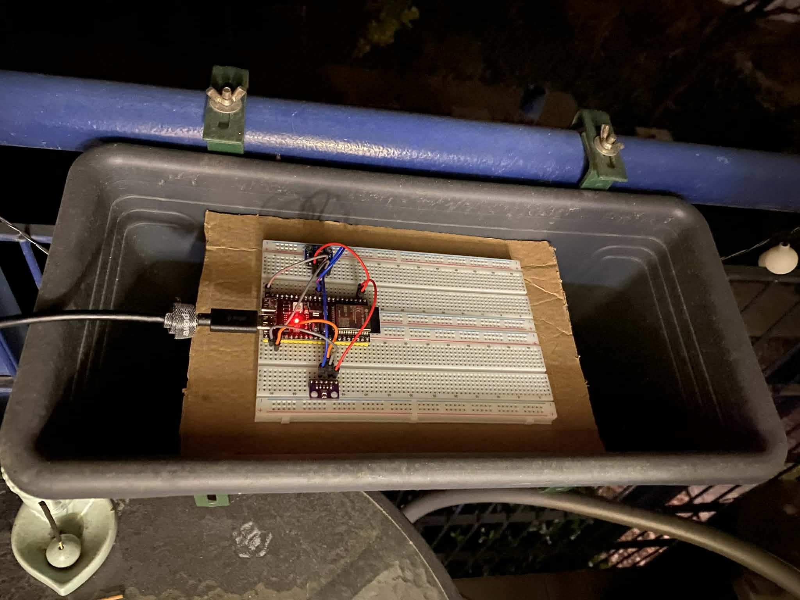
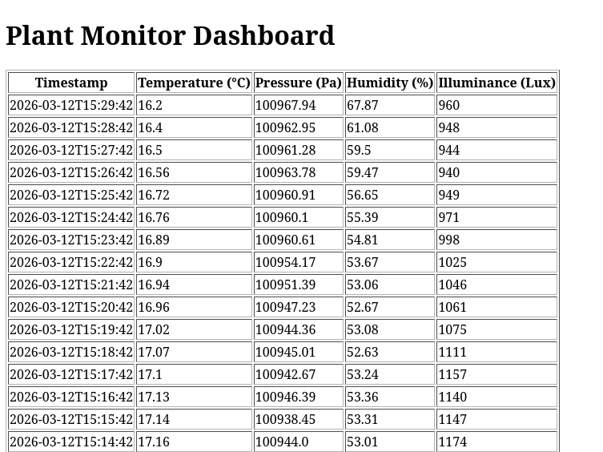

# About project

This repository contains my home project "Optimization of Plant Growth on Urban Terraces". This project tries to research every aspect of plant growing and make optimizations.

Some key concepts of the project:
- Go down every rabbit hole.
- Take measurements before and during the growing periods, draw conclusions, make correlations and improve.
- Choose the appropriate plants based on measurements.
- Research given plants from credible sources to optimize for every growing stage.
- Research soil and nutrients from credible sources to achieve a full bio growth. (No synthetic fertilizers or pesticides)
- Document results.

For other planned improvements and developments check the [## Future improvements (think-tank)](#future-improvements-think-tank) segment. 

The project is developed in ESP-IDF and (currently) builds on an ESP32-S3 N16R8 with multiple sensors such as VEML7700, BMP280 etc. Flask webapp is used for the backend using an sqlite database.The [Documentation](docs/urban_plant.pdf) is written in LaTeX.




## Setup

1. Follow [ESP-IDF wiki](https://docs.espressif.com/projects/esp-idf/en/stable/esp32/get-started/linux-macos-setup.html) and install tools.
2. Clone the repository and cd:

```bash
git clone https://github.com/ultraego4/urban_plant.git
```

## How to build and flash to device

1. Create components/network/include/credentials.h and add your wifi SSID and PASSWORD like so:
   ```c
   #define SSID "example"
   #define PASSWORD "example"
   ```
2. Source the ESP-IDF environment:
   ```bash
   get_idf
   ```
3. Set target:
   ```bash
   idf.py set-target esp32s3
   ```
4. Build the project:
   ```bash
   idf.py build
   ```
5. Flash and monitor the device (replace `/dev/ttyACM0` with your own device path):
   ```bash
   idf.py -p /dev/ttyACM0 flash monitor
   ```

## How to start measuring

1. Run the flask web app (Starts on localhost port 5000). Docker files are also included to run it on your server.
2. Power the device.
3. Refresh flask web page for updates on the database (Device logs every 1 minute).



## Project layout

Currently the main logical blocks of the project are:
- App for the ESP
- Flask backend webapp
- Data analysis
- Documentation in LaTeX

Please use the idf_component.yml manifest to add 3rd party libs from the component registry.

```bash
├── build
├── CMakeLists.txt   # root cmake
├── components
│   ├── network      # network related code (wifi,http,sntp)
│   ├── sensor       # wrappers for the managed_components
│   ├── task         # all tasks
│   └── telemetry    # queue that holds the data send via HTTP POST
│
├── data_analysis    # folder containing all calculations and plotting of data analysis
│   ├── data_analysis.ipynb      # jupyter notbook is used here
│   ├── db_snapshots             # database snapshots (currently used like this not queried)
│
├── docs             # this will be the released documentation for the whole project
│   ├── assets    # README.md assets
│   ├── tex       # folder containing the .tex files and pdf
│   └── user_manuals    #user manuals for sensors,mcu's etc.
│
├── main
│   ├── app_main.c
│   ├── CMakeLists.txt
│   └── idf_component.yml      # component manager manifest
├── managed_components         # 3rd party components from the component registry
├── README.md       # github README.md
└── webserver       # flask web app
```

## Future improvements (think-tank)

- Design the layout of the terrace for the planter boxes.
- Research a more optimal and smaller MCU for the project. 
- Design the case in freeCAD.
- Design the custom PCB.
- Camera image analysis.
- Watering system.